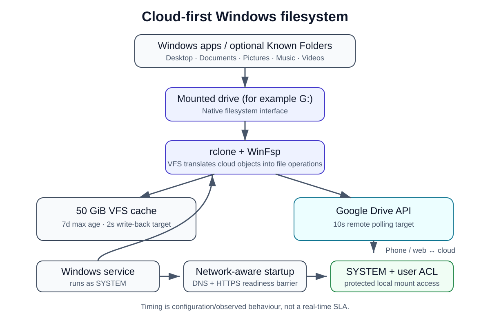

# Windows Cloud Filesystem

> Cloud-first Windows storage using rclone, WinFsp and Google Drive — built to avoid a full local mirror while keeping native filesystem access.

## Results

I built this after deciding I wanted Google Drive to behave like a native Windows filesystem without keeping hundreds of GiB permanently mirrored to my laptop.

| Reference result | Value |
|---|---:|
| Data migrated | **~304 GiB** |
| Files verified after migration | **264,869** |
| VFS cache | **50 GiB** |
| Local write-back target | **~2 s** after a file becomes inactive |
| Remote change polling target | **10 s** |
| Local mount access | **SYSTEM + selected-user ACL** |

The timing figures are **configuration targets / observed behaviour, not guarantees or a real-time SLA**. Network conditions, the Google Drive API, application file-handle behaviour and rclone's own queues can all add latency.

## Architecture



The key distinction is that this is **not `rclone bisync`** and not a full local mirror. Windows talks to a mounted cloud filesystem. rclone's VFS layer provides compatibility and a bounded local cache; Google Drive remains the canonical storage backend.

## Why I built it

The original goal was straightforward: migrate a large OneDrive dataset to Google Drive, stop depending on multiple vendor desktop clients, and avoid consuming hundreds of GiB of local SSD space just to keep the cloud usable from normal Windows applications.

It turned into a useful infrastructure project covering:

- cloud-to-cloud migration and integrity verification;
- Windows service management and startup sequencing;
- user-space filesystem behaviour through WinFsp;
- cache sizing and write-back trade-offs;
- remote-change polling;
- Windows ACLs and service-account ownership;
- Known Folder redirection and boot-time race conditions;
- debugging provider-specific API behaviour.

## How it works

Windows applications see an ordinary drive letter. The mount is created by rclone using WinFsp and runs under a Windows service. `--vfs-cache-mode full` makes applications that expect normal seekable/read-write files much more compatible with object storage. Local changes are staged through the VFS cache and become eligible for upload after the configured write-back interval; changes made through Drive web, a phone or another machine are discovered through backend polling on supported remotes.

The reference configuration uses a 50 GiB cache, a seven-day cache maximum age, a 2-second write-back target, a 10-second remote poll interval and a 24-hour directory cache. `desktop.ini` and `Thumbs.db` are filtered from the mount because cloud-backed storage does not preserve Windows NTFS metadata attributes in the same way as a native local filesystem.

For Google Drive, rclone's normal backend behaviour sends deletions to Drive's trash/bin unless that behaviour is explicitly disabled. That recovery layer was kept intact in the reference build.

## Engineering challenges

The interesting work was in the failure modes rather than the happy path:

- **OneDrive Personal Vault:** Microsoft Graph traversal returned `invalidResourceId` for the Vault, so the migration excluded it rather than treating a provider API failure as a data failure.
- **OneDrive recursive listing:** deep ListR/delta traversal produced malformed-drive-ID failures while direct directory listing worked. Disabling ListR gave a stable recursive migration path.
- **Cross-provider verification:** OneDrive and Google Drive did not expose a convenient common native hash for every object, so final parity verification used paths and sizes with `rclone check --size-only`.
- **Boot-time networking:** an automatically starting service could run before DNS was ready. A SYSTEM startup task now waits for DNS and HTTPS reachability before starting the manual service.
- **Known Folder startup race:** Windows Explorer may resolve Desktop/Documents before a cloud mount exists. Known Folder redirection is therefore documented as optional/advanced and requires startup coordination plus a rollback plan.
- **SYSTEM-owned mount permissions:** a mount created by SYSTEM is visible system-wide, but the default compatibility ACL can be insufficient for normal applications to modify existing files. WinFsp `FileSecurity` is used to present a protected ACL for SYSTEM plus the selected user.
- **Windows metadata files:** `desktop.ini` could arrive through the cloud mount with normal attributes and therefore remain visible even when Explorer's hidden-items view was off. Filtering it at the rclone layer is cleaner than repeatedly deleting it.

## Security model

The local mount is intentionally restricted to `NT AUTHORITY\SYSTEM` and one selected Windows account using a WinFsp SDDL `FileSecurity` descriptor. The rclone configuration directory and file are separately hardened with NTFS ACLs so only SYSTEM and that user have normal access.

This does **not** make the system immune to a local administrator: administrators can take ownership and change ACLs. It also does not replace Google Drive's own sharing controls. See [`docs/SECURITY-HARDENING.md`](docs/SECURITY-HARDENING.md) and [`SECURITY.md`](SECURITY.md).

## Replicate it

Start with the clean-machine guide: **[`docs/SETUP.md`](docs/SETUP.md)**.

The repository separates the portfolio story from the detailed runbook:

- [`docs/SETUP.md`](docs/SETUP.md) — build the mount from scratch;
- [`docs/MIGRATION.md`](docs/MIGRATION.md) — OneDrive → Google Drive copy and verification;
- [`docs/SECURITY-HARDENING.md`](docs/SECURITY-HARDENING.md) — mount and config ACLs;
- [`docs/KNOWN-FOLDERS.md`](docs/KNOWN-FOLDERS.md) — optional Windows Known Folder redirection;
- [`docs/TROUBLESHOOTING.md`](docs/TROUBLESHOOTING.md) — real failure modes and fixes;
- [`docs/DESIGN-NOTES.md`](docs/DESIGN-NOTES.md) — architecture trade-offs;
- [`docs/INTEGRATION-CHECKLIST.md`](docs/INTEGRATION-CHECKLIST.md) — final Windows verification checklist.

## Safety and limitations

- Never commit `rclone.conf`, OAuth tokens or raw cloud logs. See [`SECURITY.md`](SECURITY.md).
- For a migration, start with **`rclone copy`**, verify the destination, observe it for a while, and only then consider source cleanup. Do not make the first migration operation a `move`.
- `rclone check --size-only` is useful when two providers have no compatible common hash, but it does not prove byte-for-byte identity as strongly as a shared checksum or download-based comparison.
- Redirecting Windows Known Folders to a mount is less robust during early boot/logon than keeping them on local NTFS. Treat it as an optional advanced step.
- The 2-second write-back and 10-second polling values are tuning choices, not guarantees of collaborative or character-by-character live editing.
- This repository is Windows-only and does not provision cloud OAuth credentials automatically.
- Public repository tests are static/credential-free; the Windows integration checklist covers live service, WinFsp and Google Drive behaviour.

## Repository layout

```text
.
├── assets/                 # architecture graphic
├── docs/                   # setup, migration, security and troubleshooting
├── examples/               # sanitized command examples
├── scripts/                # reusable PowerShell tooling
├── tests/                  # Pester repository/static-contract tests
├── README.md
├── SECURITY.md
└── LICENSE
```

## License

MIT. See [`LICENSE`](LICENSE).
